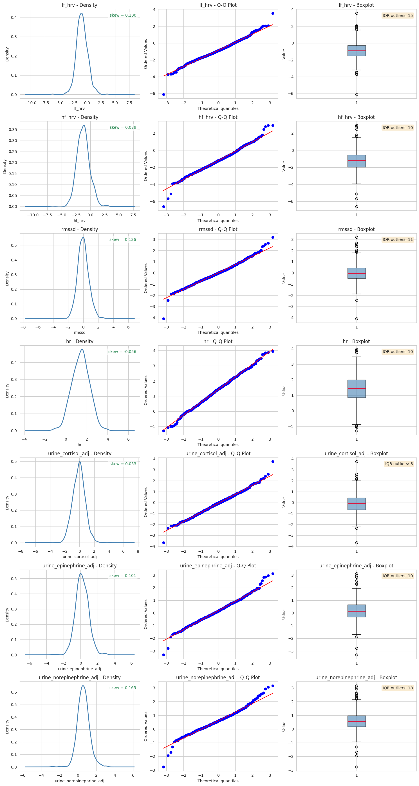
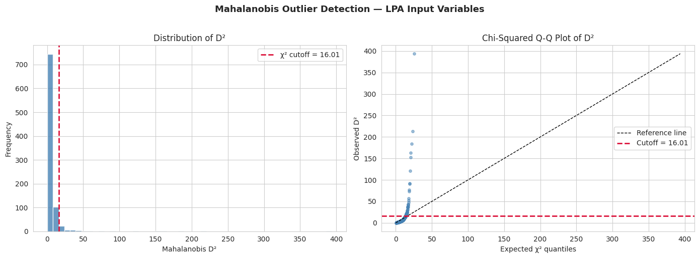
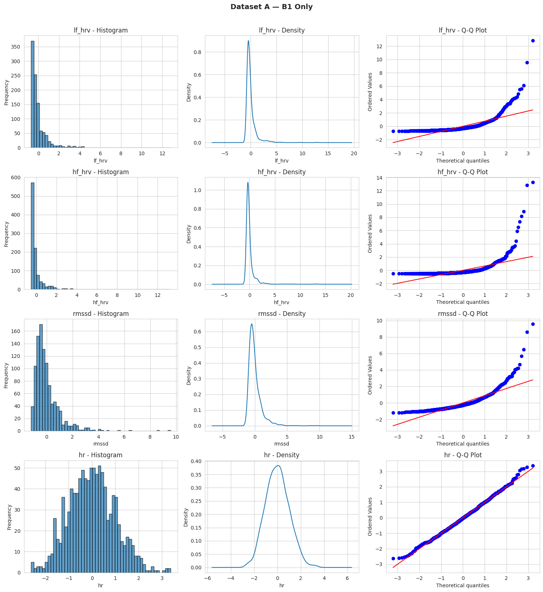
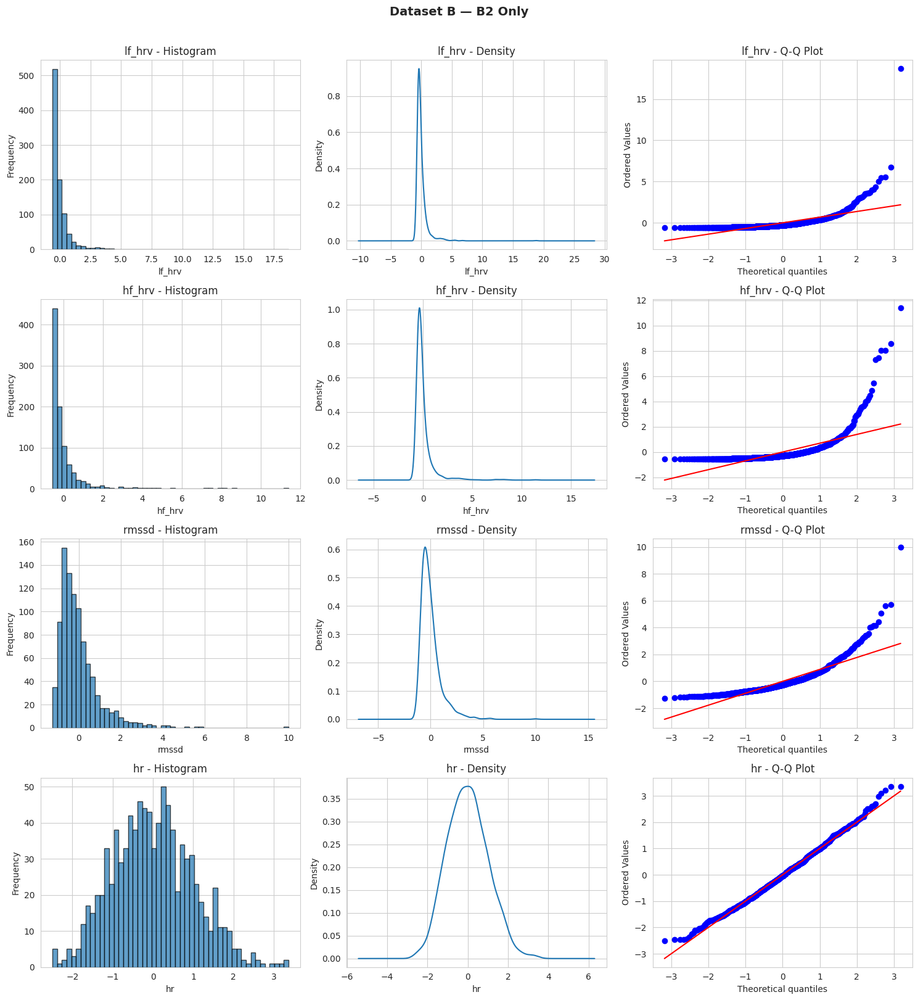

# Multisystem Stress Biomarker Analysis

[](https://github.com/JaafarBK02/Multisystem-Stress-Biomarker-Analysis/actions/workflows/tests.yml)


**Do people fall into distinct patterns of how their stress systems work together, and do those patterns predict cardiovascular and mental health?**

This repository holds the data pipeline and analysis for a research project using the **MIDUS 2 Biomarker Project**, a national U.S. study of midlife adults. We combine heart-rate variability, stress hormones and catecholamines from ~1,250 participants and use **latent profile analysis (LPA)** to find subgroups with similar multisystem stress physiology.

| | |
|---|---|
| **Data** | MIDUS 2 Biomarker Project (ICPSR 29282), resting physiology + urine assays + questionnaires |
| **Methods** | Data cleaning with codebook-aware missing-data rules, distribution diagnostics, Mahalanobis outlier detection, Box-Cox transformation, Gaussian-mixture LPA, fit-index model selection |
| **Stack** | Python · pandas · NumPy · SciPy · matplotlib/seaborn · py-latent-profiles · pytest · GitHub Actions |
| **Status** | Preprocessing and transform selection complete; LPA model fitting in progress |

---

## Research question

Most stress research studies one biological system at a time: cortisol, *or* heart rate variability, *or* adrenaline. But these systems interact, and wear-and-tear across several of them at once (allostatic load) is thought to matter more for long-term health than any single marker.

This project asks whether adults can be grouped by their **pattern** across three stress systems, and whether those groups differ in cardiovascular conditions, depression, anxiety and anger. The work is supervised by Jess Chong, PhD.

### The seven LPA indicators

| System | Indicator | What it reflects |
|---|---|---|
| Autonomic (parasympathetic) | **RMSSD**, **HF-HRV** | Beat-to-beat vagal regulation of the heart |
| Autonomic (mixed) | **LF-HRV**, **resting heart rate** | Overall autonomic balance and cardiac workload |
| HPA axis | **Urinary cortisol** (creatinine-adjusted) | Baseline neuroendocrine stress activity |
| Sympathetic–adrenal | **Urinary epinephrine**, **norepinephrine** (creatinine-adjusted) | Adrenal "fight-or-flight" output and sympathetic tone |

**Outcomes:** cardiovascular risk (any of heart disease, diabetes, stroke, high blood pressure), CES-D depression, trait anxiety, anxious distress (MASQ), trait anger, and count of major health events.

---

## Pipeline


Dashed steps are in progress. Steps A to G are implemented as a tested Python package in [`src/midus_stress/`](src/midus_stress/).

---

## Results so far

### 1. Sample

| Stage | Participants |
|---|---|
| MIDUS 2 Biomarker Project | 1,255 |
| Complete resting physiology + urine assays | 1,059 |
| ... and complete outcome measures | 1,030 |
| ... and complete covariates (LPA sample) | 897 |

*These counts are from the original run. The cleaning fixes described below change the missing-data rules, so they will shift slightly when the pipeline is re-run on the full data.*

### 2. Choosing a transform: Box-Cox beats outlier removal

Raw HRV power and urinary hormones are strongly right-skewed (skew up to 8), which violates the near-normality that Gaussian-mixture LPA relies on. We compared four strategies ([notebook 03](notebooks/03_lpa_input_eda_and_model_selection.ipynb)):


| Approach | Participants kept | Indicators with \|skew\| < 1 |
|---|---|---|
| None (raw values) | 897 | 1 / 7 |
| Multivariate Mahalanobis removal (χ², p < .025) | 847 | 2 / 7 |
| Per-variable Mahalanobis + log on LF/HF-HRV | 773 | 6 / 7 |
| **Box-Cox with a fitted λ per indicator** | **897** | **7 / 7** |

**Why outlier removal failed:** multivariate Mahalanobis distance flags people who are extreme on *many* variables at once, but the skew here is variable-specific: someone can have an extreme LF-HRV value and be typical on everything else. Per-variable removal worked better but cost 14% of the sample, and a grid search showed no threshold that fixed HF-HRV. **Box-Cox** finds the best power transform for each variable, brought all seven under the target, and removed no one, so it is the pipeline default.

<details>
<summary>Distribution diagnostics after Box-Cox (density, Q-Q, boxplot)</summary>



</details>

### 3. Which resting baseline to use

MIDUS records two resting periods (B1, B2). B2 had fewer IQR outliers (211 vs 259) but also fewer participants (940 vs 1,028). As a share of observations the difference is small (5.6% vs 6.3%), so the pipeline averages both by default and keeps `b1` / `b2` as options ([notebook 02](notebooks/02_hrv_baseline_comparison.ipynb)).

<details>
<summary>B1 and B2 distributions</summary>



</details>

---

## Data-quality fixes

Turning the exploratory Colab notebooks into a package surfaced four silent bugs. Each is now covered by a regression test in [`tests/`](tests/).

| Problem | Effect | Fix |
|---|---|---|
| One global list of missing-value codes (`7, 98, 99, ...`) applied to every column | Real values deleted: heart rates of 98–99 bpm, any biomarker or score equal to 7 | Per-column rules in [`config.py`](src/midus_stress/config.py): explicit codes, plausible ranges, allowed answers for yes/no items |
| CVD risk computed before handling missing answers | Participants who left items blank were counted as "no risk" | Risk is 1 if any condition is reported, 0 only if all four are "no", otherwise missing |
| Depression total built with `sum()` | pandas treats NaN as 0, so missing CES-D data became a score of 0 | `sum(min_count=4)`: missing if any subscale is missing |
| Log transform applied to already z-scored data | Not equivalent to transforming the measurement | Transforms run on raw values, then z-score |

An audit helper (`cleaning.audit_sentinels`) lists every candidate missing-code found in the raw file and whether it is removed, so the rules can be checked against the ICPSR codebook.

---

## Repository structure

```
├── src/midus_stress/
│   ├── config.py        # variable map + per-column missing-data rules
│   ├── cleaning.py      # extraction, missing data, depression total, CVD risk
│   ├── transforms.py    # Box-Cox / log, z-scoring, Mahalanobis, diagnostics
│   ├── pipeline.py      # end-to-end run + command-line interface
│   └── synthetic.py     # fake MIDUS-format data for demos and tests
├── notebooks/
│   ├── 01_data_processing.ipynb                    # runs the pipeline step by step
│   ├── 02_hrv_baseline_comparison.ipynb            # B1 vs B2 resting baselines
│   └── 03_lpa_input_eda_and_model_selection.ipynb  # transform comparison + LPA setup
├── figures/             # aggregate figures used in this README
├── tests/               # pytest suite (runs on synthetic data)
└── pyproject.toml
```

## Quickstart

MIDUS data cannot be redistributed, so the repo ships a **synthetic data generator** in the same column format. Everything below runs without real data.

```bash
git clone https://github.com/JaafarBK02/Multisystem-Stress-Biomarker-Analysis.git
cd Multisystem-Stress-Biomarker-Analysis
pip install -e ".[dev,notebooks]"

pytest -q                                                    # run the tests

python -m midus_stress.synthetic --output data/raw/synthetic_midus.tsv
python -m midus_stress.pipeline \
    --input  data/raw/synthetic_midus.tsv \
    --output data/processed/lpa_input.csv \
    --transform boxcox --hrv-baseline mean
```

The pipeline writes the processed CSV and a `.report.json` with row counts at each stage, Box-Cox λ values, before/after skewness, and the sentinel-code audit.

**With the real data:** request study [29282](https://www.icpsr.umich.edu/web/ICPSR/studies/29282) from ICPSR, place the export in `data/raw/` (ignored by git), and pass it as `--input`.

---

## Roadmap

- [ ] Confirm missing-value codes against the ICPSR 29282 codebook using the audit report
- [ ] Re-run preprocessing on the full data with the corrected rules
- [ ] Move covariate cleaning (age, income, education, BMI, smoking, physical activity, medications) into the package
- [ ] Fit LPA for K = 1 to 10; select using BIC, entropy (≥ .70) and interpretability
- [ ] Relate profile membership to outcomes, accounting for classification uncertainty
- [ ] Extensions: differences across racial/ethnic groups, childhood adversity as a predictor of profile membership, separate immune-marker profiles

## Team

- **Jaafar Ben Khaled**, San José State University: data pipeline, transform analysis, LPA implementation
- **Jess Chong, PhD**: research supervisor

## References

- Ryff, C. D., Seeman, T., & Weinstein, M. *Midlife in the United States (MIDUS 2): Biomarker Project, 2004–2009.* ICPSR 29282. https://doi.org/10.3886/ICPSR29282
- O'Shields, J., Soni, H., & Mowbray, O. (2026). Using social risk factors to predict allostatic biotypes of depression: A latent profile and multinomial regression analysis. *Brain, Behavior, and Immunity, 133*, 106243. https://doi.org/10.1016/j.bbi.2025.106243. Related work applying LPA to MIDUS biomarkers.
- Box, G. E. P., & Cox, D. R. (1964). An analysis of transformations. *Journal of the Royal Statistical Society: Series B, 26*(2), 211–252.

## Data use

This repository contains **code only**. MIDUS data are provided by ICPSR under terms that prohibit redistribution; no participant-level data, identifiers or derived row-level files are included. Figures show aggregate distributions only.
