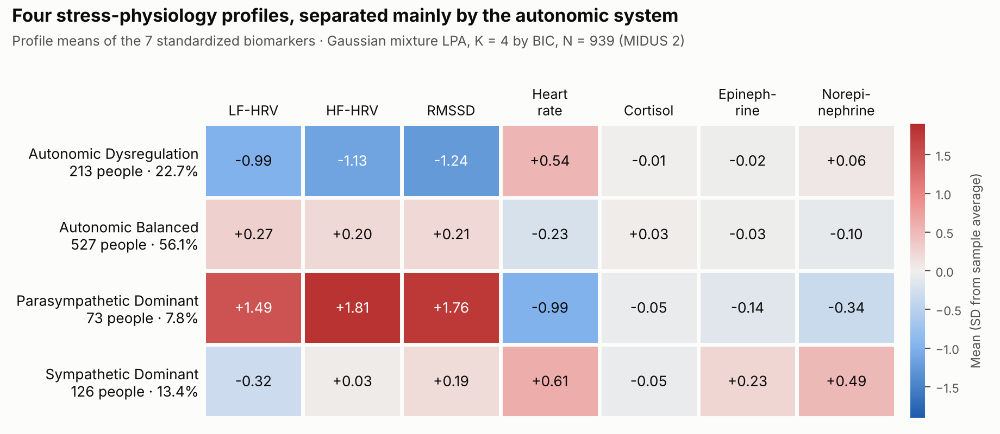
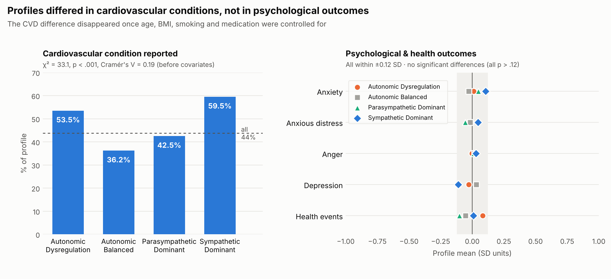
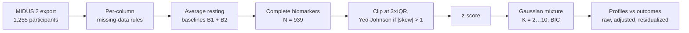
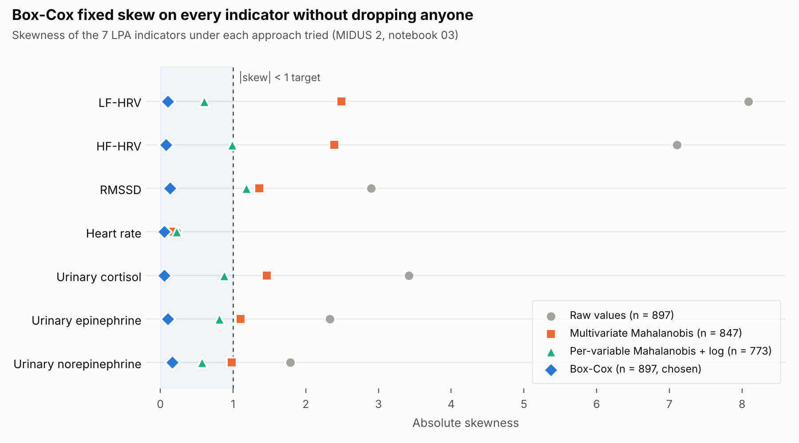

# Multisystem Stress Biomarker Analysis

[](https://github.com/JaafarBK02/Multisystem-Stress-Biomarker-Analysis/actions/workflows/tests.yml)


**Do people fall into distinct patterns of how their stress systems work together, and do those patterns predict cardiovascular and mental health?**

A cross-disciplinary research project between San José State University's **Computer Science** and **Psychology** departments, using the national **MIDUS 2 Biomarker Project**. We applied latent profile analysis to heart-rate variability, stress hormones and catecholamines from 939 adults, then tested whether the resulting profiles relate to cardiovascular and psychological outcomes.

> 📌 Presented as a poster at **SPARC 2026** (SJSU Department of Psychology research conference):
> *Multisystem Profiles of Stress Physiology: Associations with Cardiovascular and Psychological Health Outcomes.*
> Atanacio, Ben Khaled, Szymula, Gligorijevic & Chong.

| | |
|---|---|
| **Data** | MIDUS 2 Biomarker Project (ICPSR 29282): resting ECG, 12-hour urine assays, validated questionnaires |
| **Methods** | Gaussian-mixture latent profile analysis, BIC model selection, bootstrap stability (ARI), chi-square / Kruskal-Wallis, covariate-adjusted and residualized models, outlier detection, power transforms |
| **Stack** | Python · pandas · NumPy · SciPy · scikit-learn · statsmodels · matplotlib/seaborn · pytest · GitHub Actions |

---

## Key findings

**1. Four stress-physiology profiles emerged, and they differ mainly in the autonomic nervous system.**



A four-profile Gaussian mixture had the lowest BIC (15,184.5) among K = 2 to 10, with moderate bootstrap stability (adjusted Rand index 0.43). Heart-rate variability and heart rate drive most of the separation; cortisol barely differs between profiles.

| Profile | Share | Pattern |
|---|---|---|
| **Autonomic Balanced** | 56.1% | Everything near the sample average |
| **Autonomic Dysregulation** | 22.7% | Low HRV, elevated heart rate |
| **Sympathetic Dominant** | 13.4% | Elevated heart rate and norepinephrine |
| **Parasympathetic Dominant** | 7.8% | High HRV, low heart rate, low norepinephrine |

**2. Profiles tracked cardiovascular conditions, but that link was explained by demographics. They did not track psychological outcomes at all.**



- **Cardiovascular:** 59.5% of the Sympathetic Dominant profile reported a cardiovascular condition, versus 36.2% of the Balanced profile (χ² = 33.12, p < .001, Cramér's V = 0.19). After controlling for age, BMI, smoking, physical activity and medication use, profile membership no longer predicted CVD: the association was driven by shared demographic factors.
- **Psychological:** anxiety, depression, anger, anxious distress and major health events showed no profile differences (all p > .12).

**3. What this means.** Resting stress physiology carries cardiovascular information, but much of it overlaps with who people are (age, weight, smoking, medication). Biomarker profiles should be read in that demographic context, not as stand-alone screening tools. Follow-up analyses (outcome-guided clustering, residualized biomarkers, many tuned model families) all reached the same conclusion, so the null psychological result is not an artifact of one modelling choice.

---

## Pipeline



### The seven indicators

| System | Indicator | What it reflects |
|---|---|---|
| Autonomic (parasympathetic) | **RMSSD**, **HF-HRV** | Beat-to-beat vagal regulation of the heart |
| Autonomic (mixed) | **LF-HRV**, **resting heart rate** | Overall autonomic balance and cardiac workload |
| HPA axis | **Urinary cortisol** (creatinine-adjusted) | Baseline neuroendocrine stress activity |
| Sympathetic–adrenal | **Urinary epinephrine**, **norepinephrine** (creatinine-adjusted) | Adrenal "fight-or-flight" output and sympathetic tone |

**Outcomes:** cardiovascular condition (heart disease, diabetes, stroke or high blood pressure), CES-D depression, trait anxiety, MASQ anxious distress, trait anger, and count of major health events.

---

## My contributions

I'm **Jaafar Ben Khaled** (M.S. student, San José State University). On a five-person team, I worked on data quality and analysis:

- **Resting-baseline comparison.** Compared the two ECG baseline periods (B1 vs B2) and showed the difference was small relative to sample size, so the team kept the averaged measure. [Notebook 02](notebooks/02_hrv_baseline_comparison.ipynb)
- **Outlier and transform analysis** (with Jacob Atanacio). Tested multivariate and per-variable Mahalanobis filtering, log transforms and a full grid search, and showed that a per-variable power transform fixes skew without dropping participants (below). [Notebook 03](notebooks/03_lpa_input_eda_and_model_selection.ipynb)
- **Covariate-adjusted regressions and results write-up** for the SPARC abstract (with Ola Szymula).
- **Exploratory mixture-of-experts models** linking biomarkers to CVD, anger and physical health.
- **This repository.** Rebuilt the Colab preprocessing as a tested Python package, finding and fixing four silent data bugs along the way.

### Outlier removal vs. power transforms

Raw HRV power and urinary hormones are strongly right-skewed (skew up to 8), which breaks the near-normality that Gaussian-mixture LPA relies on.



| Approach (N = 897) | Participants kept | Indicators with \|skew\| < 1 |
|---|---|---|
| None (raw values) | 897 | 1 / 7 |
| Multivariate Mahalanobis removal (χ², p < .025) | 847 | 2 / 7 |
| Per-variable Mahalanobis + log on LF/HF-HRV | 773 | 6 / 7 |
| **Box-Cox with a fitted λ per indicator** | **897** | **7 / 7** |

Multivariate Mahalanobis distance flags people who are extreme on *many* variables at once, but the skew here is variable-specific. Per-variable filtering worked better but cost 14% of the sample, and no threshold fixed HF-HRV. A per-variable power transform fixed every indicator and removed no one. The final team analysis used **Yeo-Johnson**, a generalization of Box-Cox that also handles zeros, with mild 3×IQR clipping. That is the default in this package; Box-Cox is available as an option.

### Data-quality fixes

Turning the exploratory notebooks into a package surfaced four silent bugs. Each now has a regression test in [`tests/`](tests/).

| Problem | Effect | Fix |
|---|---|---|
| One global list of missing-value codes (`7, 98, 99, ...`) applied to every column | Real values deleted: heart rates of 98–99 bpm, any biomarker or score equal to 7 | Per-column rules in [`config.py`](src/midus_stress/config.py): explicit codes, plausible ranges, allowed answers for yes/no items |
| CVD flag computed before handling missing answers | Participants who left items blank were counted as "no risk" | 1 if any condition is reported, 0 only if all four are "no", otherwise missing |
| Depression total built with `sum()` | pandas treats NaN as 0, so missing CES-D data became a score of 0 | `sum(min_count=4)`: missing if any subscale is missing |
| Log transform applied to already z-scored data | Not equivalent to transforming the measurement | Transforms run on raw values, then z-score |

An audit helper (`cleaning.audit_sentinels`) lists every candidate missing-code in the raw file and whether it is removed, so the rules can be checked against the ICPSR codebook.

---

## Repository structure

```
├── src/midus_stress/
│   ├── config.py        # variable map + per-column missing-data rules
│   ├── cleaning.py      # extraction, missing data, depression total, CVD flag
│   ├── transforms.py    # winsorizing, Yeo-Johnson / Box-Cox / log, z-scores, Mahalanobis
│   ├── pipeline.py      # end-to-end run + command-line interface
│   └── synthetic.py     # fake MIDUS-format data for demos and tests
├── notebooks/
│   ├── 01_data_processing.ipynb                    # runs the pipeline step by step
│   ├── 02_hrv_baseline_comparison.ipynb            # B1 vs B2 resting baselines
│   └── 03_lpa_input_eda_and_model_selection.ipynb  # outlier/transform comparison + LPA setup
├── figures/             # aggregate figures used in this README
├── tests/               # pytest suite (runs on synthetic data)
└── pyproject.toml
```

## Quickstart

MIDUS data cannot be redistributed, so the repo ships a **synthetic data generator** in the same column format. Everything below runs without real data.

```bash
git clone https://github.com/JaafarBK02/Multisystem-Stress-Biomarker-Analysis.git
cd Multisystem-Stress-Biomarker-Analysis
pip install -e ".[dev,notebooks]"

pytest -q                                                    # run the tests

python -m midus_stress.synthetic --output data/raw/synthetic_midus.tsv
python -m midus_stress.pipeline \
    --input  data/raw/synthetic_midus.tsv \
    --output data/processed/lpa_input.csv
```

The pipeline writes the processed CSV and a `.report.json` with row counts at each stage, values clipped, transform λ values, before/after skewness, and the sentinel-code audit. Options: `--transform yeojohnson|boxcox|log|none`, `--hrv-baseline mean|b1|b2`, `--winsorize-iqr`, `--skew-threshold`.

**With the real data:** request study [29282](https://www.icpsr.umich.edu/web/ICPSR/studies/29282) from ICPSR, place the export in `data/raw/` (ignored by git), and pass it as `--input`.

---

## Next directions

- **Ethnic differences:** do Black and White adults differ in profile structure or membership? (in progress)
- **Childhood adversity:** does childhood trauma predict which stress profile a person belongs to?
- **Immune markers:** separate profiles from CRP, IL-6, TNF-α and related markers, and how they relate to the stress profiles

## Team

| | Role |
|---|---|
| **Jacob Atanacio** | Student researcher; data pipeline, covariates, LPA modelling and visualization, poster |
| **Jaafar Ben Khaled** | Student researcher (M.S.); baseline comparison, outlier/transform analysis, regressions, this repository |
| **Ola Szymula** | Student researcher; covariate and confounder analysis, regressions |
| **Jelena Gligorijevic, PhD** | Faculty advisor, Department of Computer Science |
| **Li Shen (Jesslyn) Chong, PhD** | Faculty advisor, Department of Psychology; research design |

## References

- Ryff, C. D., Seeman, T., & Weinstein, M. *Midlife in the United States (MIDUS 2): Biomarker Project, 2004–2009.* ICPSR 29282. https://doi.org/10.3886/ICPSR29282
- O'Shields, J., Soni, H., & Mowbray, O. (2026). Using social risk factors to predict allostatic biotypes of depression: A latent profile and multinomial regression analysis. *Brain, Behavior, and Immunity, 133*, 106243. https://doi.org/10.1016/j.bbi.2025.106243. Related work applying LPA to MIDUS biomarkers.
- Yeo, I.-K., & Johnson, R. A. (2000). A new family of power transformations to improve normality or symmetry. *Biometrika, 87*(4), 954–959.
- Box, G. E. P., & Cox, D. R. (1964). An analysis of transformations. *Journal of the Royal Statistical Society: Series B, 26*(2), 211–252.

## Data use

This repository contains **code only**. MIDUS data are provided by ICPSR under terms that prohibit redistribution; no participant-level data, identifiers or derived row-level files are included. Figures show aggregate statistics only.
